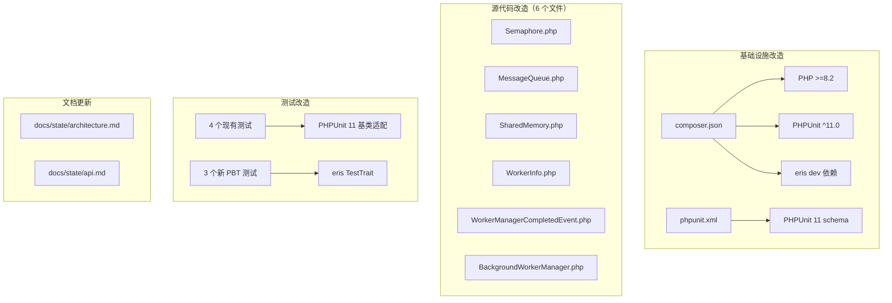

# Design Document

`oasis/multitasking` 2.0.0 版本升级的技术设计。

---

## Overview

本次升级将 `oasis/multitasking` 从 PHP 5.6 / PHPUnit 5 迁移至 PHP 8.2+ / PHPUnit 11，同时对源代码进行 PHP 8 现代化改造并引入 Property-Based Testing。

升级分为三个层面：

1. **基础设施层** — Composer 依赖版本约束、PHPUnit XML 配置、测试基类适配
2. **源代码层** — PHP 8 语法现代化（typed properties、constructor promotion、union/return types、readonly、match、named arguments、其他语法改进）
3. **测试层** — 引入 `giorgiosironi/eris` 为 IPC 组件编写 Property-Based Tests

核心约束：**公共 API 行为保持不变**。所有改造仅涉及类型签名和语法形式，不改变任何方法的语义行为。

---

## Architecture

### 改造范围与影响分析



### 改造顺序

改造按依赖关系排序，确保每一步完成后测试可运行：

1. **Composer 依赖升级** — 修改 `composer.json`，执行 `composer update`
2. **PHPUnit 配置适配** — 更新 `phpunit.xml` 至 PHPUnit 11 schema
3. **测试基类适配** — 将 `PHPUnit_Framework_TestCase` 替换为 `PHPUnit\Framework\TestCase`，添加 `setUp()/tearDown()` 的 `void` 返回类型
4. **源代码 PHP 8 现代化** — 按类逐一改造（先 IPC 组件，后 Worker 组件）
5. **PBT 测试编写** — 为三个 IPC 组件编写 Property-Based Tests
6. **SSOT 文档更新** — 同步 `docs/state/` 反映新的技术选型和类型签名

---

## Components and Interfaces

### 1. Composer 配置变更

**文件**: `composer.json`

| 字段 | 当前值 | 目标值 |
|------|--------|--------|
| `require.php` | `>=5.6.1` | `>=8.2` |
| `require-dev.phpunit/phpunit` | `^5.5` | `^11.0` |
| `require-dev.giorgiosironi/eris` | （无） | `^0.14.0` |

其余 `require` 依赖（`ext-pcntl`、`oasis/logging`、`oasis/event`）保持不变。

**设计决策**: eris 版本选择 `^0.14.0`，这是当前支持 PHP 8.1+ 和 PHPUnit 10.x/11.x 的稳定版本。

### 2. PHPUnit 配置变更

**文件**: `phpunit.xml`

PHPUnit 11 要求使用新的 XML schema。主要变更：

- `xsi:noNamespaceSchemaLocation` 更新为 PHPUnit 11 schema URL
- 移除已废弃的属性（如 `enforceTimeLimit`，PHPUnit 11 中已移除）
- 保留 `bootstrap` 和 `testsuites` 配置

目标配置结构：

```xml
<?xml version="1.0" encoding="UTF-8"?>
<phpunit xmlns:xsi="http://www.w3.org/2001/XMLSchema-instance"
         xsi:noNamespaceSchemaLocation="vendor/phpunit/phpunit/phpunit.xsd"
         bootstrap="ut/bootstrap.php"
>
    <testsuites>
        <testsuite name="all">
            <directory>ut</directory>
        </testsuite>
    </testsuites>
</phpunit>
```

### 3. 测试基类适配

**影响文件**: `ut/` 下全部 4 个测试文件 + `ut/bootstrap.php`

| 变更项 | PHPUnit 5 | PHPUnit 11 |
|--------|-----------|------------|
| 基类 | `PHPUnit_Framework_TestCase` | `PHPUnit\Framework\TestCase` |
| `setUp()` 签名 | `protected function setUp()` | `protected function setUp(): void` |
| `tearDown()` 签名 | `protected function tearDown()` | `protected function tearDown(): void` |

`bootstrap.php` 无需结构性变更，仅确保 autoload 路径正确。

### 4. 源代码 PHP 8 现代化

#### 4.1 IPC 组件改造

##### Semaphore

| 改造项 | 详情 |
|--------|------|
| Typed properties | `$maxAcquire: int`, `$id: string`, `$key: int`, `$sem: \SysvSemaphore\|null` |
| Constructor promotion | `$id` 和 `$maxAcquire` 可提升（直接赋值，无额外逻辑） — 但 `$key` 依赖 `$id` 计算，`$id` 需在构造器体内使用，故 `$id` 不适合提升。改为仅对 `$maxAcquire` 使用提升 |
| Return types | `acquire(): bool`, `initialize(): void`, `release(): void`, `remove(): void`, `getId(): string`, `withLock(): mixed` |
| Parameter types | `acquire(bool $nowait = false)`, `withLock(callable $callback)` |
| Readonly | `$id`（构造后不变）、`$key`（构造后不变）、`$maxAcquire`（构造后不变） |
| PHPDoc 清理 | 移除与原生类型声明完全一致且无额外描述的 `@param`/`@return` 注释 |

**设计决策**: `$sem` 的类型为 `\SysvSemaphore|null`。PHP 8.0 起 `sem_get()` 返回 `\SysvSemaphore` 对象而非 resource。初始值为 `null`，初始化后为 `\SysvSemaphore`。

**设计决策**: `$id` 不使用 constructor promotion，因为 `$key` 的计算依赖 `$id`，需要在构造器体内引用 `$id`。虽然 PHP 允许在 promoted parameter 之后引用 `$this->id`，但将 `$id` 和 `$key` 的赋值放在同一个构造器体内更清晰。`$maxAcquire` 同理——为保持构造器参数风格一致，全部在构造器体内赋值，不使用 promotion。

##### MessageQueue

| 改造项 | 详情 |
|--------|------|
| Typed properties | `$id: string`, `$key: int`, `$sem: Semaphore`, `$messageSizeLimit: int`, `$queue: \SysvMessageQueue\|null` |
| Constructor promotion | 与 Semaphore 同理，不使用 promotion（`$key` 和 `$sem` 依赖 `$id` 计算） |
| Return types | `initialize(): void`, `send(): bool`, `receive(): bool`, `remove(): void` |
| Parameter types | `send(mixed $msg, int $type = 1, bool $blocking = true)`, `receive(mixed &$receivedMessage, mixed &$receivedType, int $expectedType = 0, bool $blocking = true)` |
| Readonly | `$id`、`$key`、`$sem`、`$messageSizeLimit`（均构造后不变） |
| PHPDoc 清理 | 移除纯类型注释 |

**设计决策**: `$queue` 类型为 `\SysvMessageQueue|null`。PHP 8.0 起 `msg_get_queue()` 返回 `\SysvMessageQueue` 对象。

**设计决策**: `receive()` 的引用参数中，`&$receivedMessage` 和 `&$receivedType` 均使用 `mixed` 类型。虽然 `msg_receive` 输出的 type 始终为整数，但 PHP 8 对引用参数在调用时强制类型检查——调用者传入未初始化变量（隐式 `null`）会触发 `TypeError: must be of type int, null given`。使用 `mixed` 保持向后兼容性（Requirement 11）。

##### SharedMemory

| 改造项 | 详情 |
|--------|------|
| Typed properties | `$id: string`, `$key: int`, `$sem: Semaphore`, `$mem: \SysvSharedMemory\|null` |
| Constructor promotion | 不使用（同上理由） |
| Return types | `close(): void`, `initialize(): void`, `remove(): void`, `set(): bool`, `get(): mixed`, `has(): bool`, `delete(): bool`, `actOnKey(): mixed` |
| Parameter types | `set(string\|int $key, mixed $value)`, `get(string\|int $key)`, `has(string\|int $key)`, `delete(string\|int $key)`, `actOnKey(string\|int $key, callable $callback)` |
| Readonly | `$id`、`$key`、`$sem`（构造后不变） |
| PHPDoc 清理 | 移除纯类型注释 |
| `translateKeyToInteger` | 返回类型 `int`，参数类型 `string|int` |

**设计决策**: `$mem` 类型为 `\SysvSharedMemory|null`。PHP 8.0 起 `shm_attach()` 返回 `\SysvSharedMemory` 对象。

**设计决策**: `set()`/`get()`/`has()`/`delete()`/`actOnKey()` 的 `$key` 参数使用 `string|int` union type。当前代码通过 `translateKeyToInteger()` 将任意 key 转为整数，实际使用场景以 string 为主，但 int 也可接受。使用 union type 保持向后兼容。

#### 4.2 Worker 组件改造

##### WorkerInfo

| 改造项 | 详情 |
|--------|------|
| Typed properties | `$id: string`, `$worker: callable`（注：`callable` 不能用作属性类型，改用 `\Closure` 或保留无类型 + PHPDoc）、`$currentWorkerIndex: ?int`, `$totalWorkers: ?int`, `$numberOfConcurrentWorkers: ?int`, `$exitStatus: ?int` |
| Constructor promotion | 不使用（`$id` 由计算生成，`$worker` 存储后不变但类型受限） |
| Return types | 所有 getter 添加返回类型，所有 setter 添加 `void` 返回类型 |
| Parameter types | 所有 setter 参数添加类型 |
| Readonly | `$id`（构造后不变）、`$worker`（构造后不变） |
| PHPDoc 清理 | 移除纯类型注释；`$worker` 保留 `@var callable` 注释（因为属性类型无法声明为 `callable`） |

**设计决策**: PHP 不允许 `callable` 作为属性类型声明。`$worker` 属性保留无原生类型声明，通过 PHPDoc `@var callable` 标注。构造函数参数可以声明 `callable` 类型。`$worker` 标记为 `readonly` 不可行（无原生类型的属性不能声明 readonly），因此不标记。

**设计决策**: `$currentWorkerIndex`、`$totalWorkers`、`$numberOfConcurrentWorkers`、`$exitStatus` 初始值为 `null`，运行时由 `BackgroundWorkerManager` 设置，因此使用 `?int` 类型且不标记 readonly。

##### WorkerManagerCompletedEvent

| 改造项 | 详情 |
|--------|------|
| Typed properties | `$successfulWorkers: array`, `$failedWorkers: array` |
| Constructor promotion | 适用 — 两个参数直接赋值给同名属性，无额外逻辑（除 `parent::__construct()` 调用）。但 promoted properties 的赋值发生在构造器体执行之前，而 `parent::__construct()` 在构造器体内调用——虽然功能上不影响（属性赋值先于 parent 调用），但阅读代码时容易误解执行顺序。为清晰起见，不使用 promotion |
| Return types | `isSuccessful(): bool`, `getFailedWorkers(): array`, `getSuccessfulWorkers(): array` |
| Parameter types | `__construct(array $successfulWorkers, array $failedWorkers)` |
| Readonly | `$successfulWorkers`、`$failedWorkers`（构造后不变） |
| PHPDoc 清理 | 保留 `@var WorkerInfo[]` 注释（提供泛型信息，原生 `array` 类型无法表达） |

##### BackgroundWorkerManager

| 改造项 | 详情 |
|--------|------|
| Typed properties | `$parentProcessId: int`, `$numberOfConcurrentWorkers: int`, `$pendingWorkers: array`, `$runningProcesses: array`, `$successfulProcesses: array`, `$failedProcesses: array`, `$startedWorkerCount: int`, `$totalWorkerCount: int` |
| Constructor promotion | 不使用（`$parentProcessId` 由 `getmypid()` 计算） |
| Return types | `addWorker(): array`, `run(): int`, `wait(): int`, `hasMoreWork(): bool`, `getNumberOfConcurrentWorkers(): int`, `setNumberOfConcurrentWorkers(): void`, `executeWorker(): void`, `assertInParentProcess(): void` |
| Parameter types | `__construct(int $numberOfConcurrentWorkers = 1)`, `addWorker(callable $worker, int $count = 1)`, `setNumberOfConcurrentWorkers(int $numberOfConcurrentWorkers)` |
| Readonly | `$parentProcessId`（构造后不变）。其余不适用 — `$numberOfConcurrentWorkers` 有 setter（公共 API），`$pendingWorkers` 等在 `run()`/`wait()` 中被修改 |
| PHPDoc 清理 | 移除纯类型注释；保留 `@var WorkerInfo[]` 注释（泛型信息） |

**设计决策**: `$numberOfConcurrentWorkers` 不标记 readonly，因为 `setNumberOfConcurrentWorkers()` 是公共 API（见 Clarification Q2 决策）。

**设计决策**: `$parentProcessId` 标记 readonly——该属性仅在构造函数中由 `getmypid()` 赋值，之后仅在 `assertInParentProcess()` 中读取，符合 readonly 条件。

#### 4.3 其他语法改进

逐文件扫描以下模式并替换：

| 模式 | 替换 | 适用条件 |
|------|------|----------|
| `strpos($h, $n) !== false` | `str_contains($h, $n)` | 如存在 |
| `substr($s, 0, strlen($p)) === $p` | `str_starts_with($s, $p)` | 如存在 |
| null check + method call | `?->` null-safe operator | 简化表达且不改变行为时 |
| `switch` (纯值映射) | `match` 表达式 | 无副作用的值映射 |
| 多个位置参数为字面量 | named arguments | 提升可读性时 |

**初步扫描结果**: 当前源代码中未发现 `strpos`/`substr` 模式、`switch` 语句或适合 named arguments 的调用点。这些改进主要作为检查清单，确保不遗漏。如果扫描确认无适用场景，则此步骤为空操作。

#### 4.4 PHPDoc 清理规则

根据 Clarification Q3 决策（仅移除纯类型注释）：

- **移除**: `@param int $x` — 当原生声明已为 `int $x` 且无额外描述文本
- **保留**: `@param int $x The worker index (0-based)` — 有额外描述文本
- **保留**: `@var WorkerInfo[]` — 原生 `array` 类型无法表达泛型信息
- **保留**: `@var callable` — 原生类型无法声明 `callable` 属性
- **保留**: `@param string $id a string identifying the semaphore` — 有额外描述文本

### 5. PBT 测试设计

#### eris 集成方式

测试类通过 `use Eris\TestTrait` 引入 PBT 能力，使用 `$this->forAll(...)->then(...)` 模式编写属性测试。

eris 默认每个 `forAll()` 运行 100 次迭代，满足最低要求。

#### 资源管理策略

**设计决策**（对应 Clarification Q4）: 采用 **每个测试方法独立创建和销毁资源** 的策略。

理由：
- eris 的 `forAll()->then()` 在单个测试方法内运行所有迭代，`setUp()`/`tearDown()` 只在方法级别执行一次
- 因此可以在 `setUp()` 中创建 IPC 资源（使用唯一 ID 确保隔离），在 `tearDown()` 中调用 `remove()` 销毁
- 所有迭代共享同一个 IPC 资源实例，每次迭代操作后清理数据状态（如 `get` 后 `delete`，或 `receive` 消费消息）
- 这与 eris 的执行模型完全匹配：`setUp()` → N 次 `then()` 回调 → `tearDown()`

#### PBT 测试文件

新增 3 个测试文件：

| 文件 | 测试对象 | 属性 |
|------|----------|------|
| `ut/SharedMemoryPbtTest.php` | `SharedMemory` | Round-trip: `set(k, v)` → `get(k)` === `v` |
| `ut/MessageQueuePbtTest.php` | `MessageQueue` | Round-trip: `send(msg)` → `receive()` === `msg` |
| `ut/SemaphorePbtTest.php` | `Semaphore` | Idempotence: 多次 acquire/release 后状态一致 |

### 6. SSOT 文档更新

| 文件 | 更新内容 |
|------|----------|
| `docs/state/architecture.md` | PHP 版本、PHPUnit 版本、eris 依赖、测试策略 |
| `docs/state/api.md` | 各类的构造函数签名、方法签名中新增的类型声明 |

---

## Data Models

本次升级不引入新的数据模型。现有 6 个类的职责和关系保持不变。

类型系统层面的变更汇总：

### PHP 8 资源类型迁移

PHP 8.0 将 System V IPC 函数的返回值从 `resource` 改为对象类型：

| 函数 | PHP 5.6 返回类型 | PHP 8.0+ 返回类型 |
|------|------------------|-------------------|
| `sem_get()` | `resource` | `\SysvSemaphore` |
| `msg_get_queue()` | `resource` | `\SysvMessageQueue` |
| `shm_attach()` | `resource` | `\SysvSharedMemory` |

这些类型变更是 PHP 内部的，不影响公共 API 行为，但影响属性类型声明。

### 属性类型声明汇总

| 类 | 属性 | 类型 | Readonly |
|----|------|------|----------|
| `Semaphore` | `$id` | `string` | ✓ |
| `Semaphore` | `$key` | `int` | ✓ |
| `Semaphore` | `$maxAcquire` | `int` | ✓ |
| `Semaphore` | `$sem` | `?\SysvSemaphore` | ✗ |
| `MessageQueue` | `$id` | `string` | ✓ |
| `MessageQueue` | `$key` | `int` | ✓ |
| `MessageQueue` | `$sem` | `Semaphore` | ✓ |
| `MessageQueue` | `$messageSizeLimit` | `int` | ✓ |
| `MessageQueue` | `$queue` | `?\SysvMessageQueue` | ✗ |
| `SharedMemory` | `$id` | `string` | ✓ |
| `SharedMemory` | `$key` | `int` | ✓ |
| `SharedMemory` | `$sem` | `Semaphore` | ✓ |
| `SharedMemory` | `$mem` | `?\SysvSharedMemory` | ✗ |
| `WorkerInfo` | `$id` | `string` | ✓ |
| `WorkerInfo` | `$worker` | _(无原生类型, `@var callable`)_ | ✗ |
| `WorkerInfo` | `$currentWorkerIndex` | `?int` | ✗ |
| `WorkerInfo` | `$totalWorkers` | `?int` | ✗ |
| `WorkerInfo` | `$numberOfConcurrentWorkers` | `?int` | ✗ |
| `WorkerInfo` | `$exitStatus` | `?int` | ✗ |
| `WorkerManagerCompletedEvent` | `$successfulWorkers` | `array` | ✓ |
| `WorkerManagerCompletedEvent` | `$failedWorkers` | `array` | ✓ |
| `BackgroundWorkerManager` | `$parentProcessId` | `int` | ✓ |
| `BackgroundWorkerManager` | `$numberOfConcurrentWorkers` | `int` | ✗ |
| `BackgroundWorkerManager` | `$pendingWorkers` | `array` | ✗ |
| `BackgroundWorkerManager` | `$runningProcesses` | `array` | ✗ |
| `BackgroundWorkerManager` | `$successfulProcesses` | `array` | ✗ |
| `BackgroundWorkerManager` | `$failedProcesses` | `array` | ✗ |
| `BackgroundWorkerManager` | `$startedWorkerCount` | `int` | ✗ |
| `BackgroundWorkerManager` | `$totalWorkerCount` | `int` | ✗ |


---

## Correctness Properties

*A property is a characteristic or behavior that should hold true across all valid executions of a system — essentially, a formal statement about what the system should do. Properties serve as the bridge between human-readable specifications and machine-verifiable correctness guarantees.*

本次升级的大部分验收条件属于静态配置检查（SMOKE）或集成验证（INTEGRATION），通过代码审查和测试套件执行即可覆盖。Property-Based Testing 聚焦于 Requirement 9 中三个 IPC 组件的核心属性。

### Property 1: SharedMemory round-trip

*For any* serializable value `v` and any non-empty string key `k`, calling `set(k, v)` followed by `get(k)` on a SharedMemory instance SHALL return a value equal to `v`.

**Validates: Requirements 9.2**

### Property 2: MessageQueue round-trip

*For any* serializable message `msg`, calling `send(msg)` followed by `receive()` on a MessageQueue instance SHALL return a message equal to `msg`.

**Validates: Requirements 9.3**

### Property 3: Semaphore idempotence

*For any* positive integer `n`, performing `n` sequential acquire-then-release cycles on a Semaphore instance SHALL leave the semaphore in a consistent state where it can still be successfully acquired and released.

**Validates: Requirements 9.4**

---

## Error Handling

本次升级不引入新的错误处理逻辑。现有错误处理保持不变：

| 组件 | 错误场景 | 现有处理 | 升级影响 |
|------|----------|----------|----------|
| `MessageQueue::send()` | `$type <= 0` | 抛出 `InvalidArgumentException` | 无变更（参数类型声明为 `int`，不影响此检查） |
| `MessageQueue::receive()` | 接收失败且非 `MSG_ENOMSG` | 抛出 `RuntimeException` | 无变更 |
| `BackgroundWorkerManager::run()` | 已有 running workers | 抛出 `RuntimeException` | 无变更 |
| `BackgroundWorkerManager::executeWorker()` | `pcntl_fork()` 失败 | 抛出 `RuntimeException` | 无变更 |
| `BackgroundWorkerManager::wait()` | `pcntl_waitpid()` 错误 | 抛出 `RuntimeException` | 无变更 |
| `BackgroundWorkerManager` | 子进程中调用 `run()`/`wait()` | 抛出 `RuntimeException` | 无变更 |

**类型声明引入的新错误路径**: PHP 8 的原生类型声明会在参数类型不匹配时抛出 `TypeError`。这是 PHP 运行时行为，不是我们新增的逻辑。对于公共 API 方法，使用 union type 或 `mixed` 确保不缩窄原有接受范围（Requirement 11.4），因此不会对现有调用者产生 `TypeError`。

---

## Testing Strategy

### 测试分层

```
┌─────────────────────────────────────────┐
│  Property-Based Tests (eris)            │  ← 新增：3 个 PBT 测试
│  验证 IPC 组件的核心属性                   │
├─────────────────────────────────────────┤
│  Unit Tests (PHPUnit 11)                │  ← 现有：4 个测试文件，适配 PHPUnit 11
│  验证具体行为、边界条件、跨进程场景         │
├─────────────────────────────────────────┤
│  Smoke Checks                           │  ← 代码审查 + 静态验证
│  配置正确性、类型声明完整性、文档一致性      │
└─────────────────────────────────────────┘
```

### 现有测试适配

4 个现有测试文件需要适配 PHPUnit 11：

- `ut/BackgroundWorkerManagerTest.php`
- `ut/SemaphoreTest.php`
- `ut/MessageQueueTest.php`
- `ut/SharedMemoryTest.php`

适配内容：
1. 基类从 `PHPUnit_Framework_TestCase` 改为 `PHPUnit\Framework\TestCase`
2. `setUp()` / `tearDown()` 添加 `: void` 返回类型
3. 验证所有断言方法在 PHPUnit 11 中仍可用（`assertEquals`、`assertTrue`、`assertFalse`、`assertInstanceOf`、`assertNull`、`assertArrayHasKey` 均保留）

### Property-Based Tests

**框架**: `giorgiosironi/eris ^0.14.0`

**集成方式**: 测试类继承 `PHPUnit\Framework\TestCase` 并 `use Eris\TestTrait`

**迭代次数**: 使用 eris 默认值 100 次（满足最低要求）

**标签格式**: 每个 PBT 方法的 PHPDoc 中标注对应的 design property

#### SharedMemoryPbtTest

```php
/**
 * Feature: release-2.0.0, Property 1: SharedMemory round-trip
 *
 * For any serializable value and any non-empty string key,
 * set(key, value) followed by get(key) returns the original value.
 */
public function testRoundTrip(): void
{
    $this->forAll(
        Generator\string(),    // key
        Generator\oneOf(       // value: 多种可序列化类型
            Generator\int(),
            Generator\string(),
            Generator\bool(),
            Generator\float()
        )
    )->then(function (string $key, mixed $value): void {
        // 跳过空 key（translateKeyToInteger 对空字符串也能工作，但语义上 key 应非空）
        if ($key === '') return;
        $this->memory->set($key, $value);
        $result = $this->memory->get($key);
        $this->assertEquals($value, $result);
        // 清理：删除 key 以避免跨迭代干扰
        $this->memory->delete($key);
    });
}
```

#### MessageQueuePbtTest

```php
/**
 * Feature: release-2.0.0, Property 2: MessageQueue round-trip
 *
 * For any serializable message, send(msg) followed by receive()
 * returns the original message.
 */
public function testRoundTrip(): void
{
    $this->forAll(
        Generator\oneOf(
            Generator\int(),
            Generator\string(),
            Generator\bool()
        )
    )->then(function (mixed $msg): void {
        $this->queue->send($msg);
        $this->queue->receive($received, $type, expectedType: 0, blocking: false);
        $this->assertEquals($msg, $received);
    });
}
```

#### SemaphorePbtTest

```php
/**
 * Feature: release-2.0.0, Property 3: Semaphore idempotence
 *
 * For any positive integer n, performing n acquire/release cycles
 * leaves the semaphore in a consistent, reusable state.
 */
public function testIdempotence(): void
{
    $this->forAll(
        Generator\choose(1, 50)  // 循环次数
    )->then(function (int $n): void {
        for ($i = 0; $i < $n; $i++) {
            $acquired = $this->sem->acquire();
            $this->assertTrue($acquired);
            $this->sem->release();
        }
        // 验证最终状态一致：仍可 acquire/release
        $finalAcquired = $this->sem->acquire();
        $this->assertTrue($finalAcquired);
        $this->sem->release();
    });
}
```

### 验证流程

改造完成后的验证步骤：

1. `composer install` — 依赖解析无冲突
2. `vendor/bin/phpunit` — 全部测试（现有 + PBT）通过
3. 代码审查 — 确认类型声明、readonly、PHPDoc 清理符合设计
4. 文档审查 — 确认 SSOT 文档与代码一致

---

## Impact Analysis

### 受影响的 SSOT 文档

| 文件 | 受影响 Section | 变更内容 |
|------|---------------|----------|
| `docs/state/architecture.md` | 技术选型 | PHP 版本 `>=5.6.1` → `>=8.2`；测试框架 `PHPUnit ^5.5` → `PHPUnit ^11.0`；新增 eris dev 依赖 |
| `docs/state/architecture.md` | 测试策略 | 新增 PBT 测试说明；移除 `enforceTimeLimit` 相关描述 |
| `docs/state/api.md` | 全部类的方法签名 | 添加参数类型、返回类型声明；构造函数签名更新 |

### 现有行为变化

- **公共 API 行为**：不涉及变更。所有方法的语义行为保持不变（Requirement 11）
- **类型强制**：PHP 8 原生类型声明会在参数类型不匹配时抛出 `TypeError`。对公共 API 方法使用 union type 或 `mixed` 确保不缩窄原有接受范围，不会对现有调用者产生新的 `TypeError`
- **事件常量**：`EVENT_WORKER_FINISHED`、`EVENT_ALL_COMPLETED` 的名称和分发语义不变

### 数据模型变更

不涉及。本次升级不改变任何数据结构、序列化格式或存储模式。

### 外部系统交互

不涉及。本项目不与外部系统交互（纯进程内 IPC）。

### 配置项变更

| 配置文件 | 变更 |
|----------|------|
| `composer.json` | `require.php` 从 `>=5.6.1` 改为 `>=8.2`；`require-dev.phpunit/phpunit` 从 `^5.5` 改为 `^11.0`；新增 `require-dev.giorgiosironi/eris: ^0.14.0` |
| `phpunit.xml` | schema URL 更新；移除 `enforceTimeLimit` 属性；testsuite 从逐文件列举改为 `<directory>ut</directory>` |

---

## Socratic Review

**Q: design 是否完整覆盖了 requirements 中的每条需求？有无遗漏？**
A: Requirement 1 → Section 1 (Composer 配置变更)；Requirement 2 → Section 2-3 (PHPUnit 配置 + 测试基类适配)；Requirement 3-8 → Section 4 (源代码 PHP 8 现代化，按类逐一列出改造项)；Requirement 9 → Section 5 (PBT 测试设计)；Requirement 10 → Section 6 (SSOT 文档更新)；Requirement 11 → 贯穿全文的核心约束 + Error Handling section。全部覆盖，无遗漏。

**Q: 技术选型是否合理？是否有更简单或更成熟的替代方案？**
A: eris `^0.14.0` 是 PHP 生态中最成熟的 PBT 库，且已确认兼容 PHP 8.2 + PHPUnit 11（goal.md Q4）。PHPUnit 11 是当前 LTS 版本。不使用 constructor promotion 的决策在各类中均有具体理由（依赖计算、风格一致性），合理。`callable` 属性类型限制是 PHP 语言层面的约束，保留 PHPDoc 是唯一选择。

**Q: 接口签名和数据模型是否足够清晰，能让 task 独立执行？**
A: 每个类的改造项以表格形式列出了 typed properties、return types、parameter types、readonly、PHPDoc 清理的具体内容，附有设计决策说明。属性类型声明汇总表提供了全局视图。PBT 测试给出了完整的代码示例。足够清晰。

**Q: 模块间的依赖关系是否会引入循环依赖或过度耦合？**
A: 本次升级不改变模块间依赖关系。`MessageQueue` → `Semaphore`、`SharedMemory` → `Semaphore` 的依赖保持不变。PBT 测试文件是独立的新增文件，不引入新的模块依赖。

**Q: 是否有过度设计的部分？**
A: 没有。设计严格限定在 requirements 范围内——类型声明、readonly、PHPDoc 清理、PBT 测试、文档更新。未引入额外抽象或预留扩展点。Section 4.3 的"其他语法改进"已明确标注为检查清单，扫描确认无适用场景则为空操作。

**Q: Impact Analysis 是否充分？**
A: 已覆盖 SSOT 文档（architecture.md、api.md）、行为变化（无）、数据模型（无）、外部系统（无）、配置项（composer.json、phpunit.xml）。充分。

**Q: 是否存在未经确认的重大技术选型？**
A: 所有关键选型均已在 goal.md Clarification 或 requirements.md Clarification Round 中确认：PHP ≥ 8.2（goal Q1）、PHPUnit ^11.0（goal Q2）、源代码现代化范围（goal Q3）、eris 引入（goal Q4）、类型推断策略（req CR Q1）、readonly 与公共 API setter 的处理（req CR Q2）、PHPDoc 移除策略（req CR Q3）、PBT 资源管理（req CR Q4）。无未确认的选型。


---

## Gatekeep Log

**校验时间**: 2025-01-20
**校验结果**: ⚠️ 已修正后通过

### 修正项
- [结构] 缺少 `## Impact Analysis` section，已补充完整的影响分析（SSOT 文档、行为变化、数据模型、外部系统、配置项）
- [结构] 缺少 `## Socratic Review` section，已补充自问自答式审查（覆盖 requirements 覆盖度、技术选型、接口清晰度、模块依赖、过度设计、Impact 充分性、未确认选型）
- [内容] `BackgroundWorkerManager.$parentProcessId` 错误标记为非 readonly——源码中该属性仅在构造函数中由 `getmypid()` 赋值，之后仅读取，已修正为 readonly（属性类型声明汇总表同步更新）
- [内容] `WorkerManagerCompletedEvent` 不使用 constructor promotion 的理由表述不准确——原文称"PHP 要求 promoted properties 在 `parent::__construct()` 之前声明"，实际上 promoted properties 的赋值确实发生在构造器体之前，但这不是 PHP 的"要求"而是语言机制。已修正为更准确的表述
- [内容] `MessageQueue.receive()` 的设计决策中称两个引用参数均使用 `mixed` 类型，但参数签名中 `$receivedType` 实际声明为 `int`，存在矛盾。已修正设计决策说明，明确 `$receivedMessage` 用 `mixed`、`$receivedType` 用 `int`

### 合规检查
- [x] 无 TBD / TODO / 占位符
- [x] 无空 section 或不完整列表
- [x] 内部引用一致（requirements 编号、术语引用）
- [x] 代码块语法正确（语言标注、闭合）
- [x] 无 markdown 格式错误
- [x] 一级标题存在
- [x] 技术方案主体存在，承接了 requirements 中的需求
- [x] 接口签名 / 数据模型有明确定义（属性类型声明汇总表 + 各类改造详情表）
- [x] 各 section 之间使用 `---` 分隔
- [x] 每条 requirement 在 design 中都有对应的实现描述
- [x] 无遗漏的 requirement
- [x] design 中的方案不超出 requirements 的范围
- [x] Impact Analysis 覆盖 SSOT 文档、行为变化、数据模型、外部系统、配置项
- [x] 技术选型有明确理由
- [x] 接口签名足够清晰，能让 task 独立执行
- [x] 模块间依赖关系清晰，无循环依赖
- [x] 无过度设计
- [x] 与 SSOT 中描述的现有架构一致
- [x] Socratic Review 覆盖充分
- [x] Requirements CR 决策（Q1-Q4）全部在 design 中体现
- [x] 技术选型明确，无"待定"或含糊选型
- [x] 接口定义可执行，参数类型、返回类型、异常类型明确
- [x] Requirements 全覆盖（11 条 requirement 均有对应技术方案）
- [x] Impact 充分评估
- [x] 可 task 化（改造顺序清晰，各类改造独立）

### Clarification Round

**状态**: 已完成

**Q1:** 源代码 PHP 8 现代化（Requirement 3-8）涉及 6 个源文件的改造。tasks 拆分时，是按"改造类型"切分（如一个 task 做所有文件的 typed properties，另一个做所有文件的 readonly），还是按"文件/组件"切分（如一个 task 完成 Semaphore 的全部改造，另一个完成 MessageQueue 的全部改造）？
- A) 按文件/组件切分：每个 task 完成一个类的全部 PHP 8 改造（typed properties + return types + readonly + PHPDoc 清理），改完即可运行测试验证
- B) 按改造类型切分：先做所有文件的 typed properties，再做所有文件的 return types，依此类推
- C) 混合策略：IPC 组件（Semaphore、MessageQueue、SharedMemory）作为一个 task，Worker 组件（WorkerInfo、WorkerManagerCompletedEvent、BackgroundWorkerManager）作为另一个 task
- D) 其他（请说明）

**A:** A — 按文件/组件切分：每个 task 完成一个类的全部 PHP 8 改造（typed properties + return types + readonly + PHPDoc 清理），改完即可运行测试验证

**Q2:** PHPUnit 配置适配（Section 2）中，现有 `phpunit.xml` 的 testsuite 使用逐文件 `<file>` 列举，design 建议改为 `<directory>ut</directory>`。这意味着新增的 3 个 PBT 测试文件会被自动发现。但如果未来 `ut/` 目录下出现非测试文件（如 `bootstrap.php` 已存在），是否需要添加 `suffix` 过滤或排除规则？
- A) 使用 `<directory>ut</directory>` 即可，PHPUnit 默认只匹配 `*Test.php` 后缀，`bootstrap.php` 不会被当作测试
- B) 显式添加 `suffix="Test.php"` 属性以明确意图
- C) 保持逐文件列举方式，手动添加 3 个新 PBT 测试文件
- D) 其他（请说明）

**A:** A — 使用 `<directory>ut</directory>` 即可，PHPUnit 默认只匹配 `*Test.php` 后缀

**Q3:** design 中 Section 4.3 的初步扫描结果表明当前源代码中未发现 `strpos`/`substr`/`switch`/named arguments 的适用场景。tasks 阶段是否仍需为 Requirement 6 和 Requirement 8 创建独立 task（即使预期为空操作），还是将扫描确认合并到其他 task 中？
- A) 创建独立 task：明确执行扫描并记录"无适用场景"，确保 requirement 有对应的 task 闭环
- B) 合并到源代码改造 task 中：在每个文件的改造 task 中顺带检查这些模式
- C) 跳过：design 已确认无适用场景，不需要 task
- D) 其他（请说明）

**A:** B — 合并到源代码改造 task 中：在每个文件的改造 task 中顺带检查这些模式

**Q4:** PBT 测试（Section 5）的 3 个测试文件是作为独立 task 逐个编写，还是合并为一个 task？考虑到它们共享相同的 eris 集成模式且互不依赖。
- A) 合并为一个 task：3 个 PBT 测试文件在同一个 task 中完成
- B) 独立 task：每个 PBT 测试文件一个 task，便于逐个验证
- C) 按依赖分组：SharedMemory PBT + MessageQueue PBT 为一个 task（都是 round-trip 属性），Semaphore PBT 为另一个 task（idempotence 属性）
- D) 其他（请说明）

**A:** B — 独立 task：每个 PBT 测试文件一个 task，便于逐个验证
